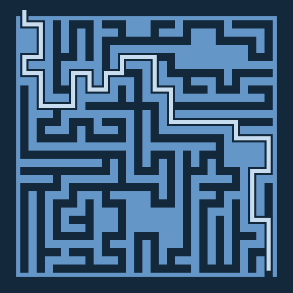

Some toy maze-ing
=================

The purpose is to see how a maze can be generated and solved, what kind of variations are there. The final goal is to see how an unaware solver can go through.




# Requirements

- C++11 compiler
- SDL2

(Your include path might vary.)


# Run

```bash
make && ./main <W> <H> -ag
```

Where you use the appropriate maze W and H params. `-a` is to present an Ascii map. `-g` is to present a graphical UI (SDL).


# Appetizer

```
║╔═╔╗╔═╗ ╔══╗╔═╔═════════════╗═╗
║╚╗║╠╣║║ ╠══║║╔╝╔╦══════════╗╚═╝
╚═╬╝║╠╝╚╗║╔═╣╠╣╔╝╚═╔═║╔══╦╗║╚═══
═╗║═╝╚═╗║╔╝║║║╚╩═╗║║║║║═╗║╚╬╦══╗
╔╣╚╗  ╔╝║║╔╝║╠═╗╔╩╝║╚╣╠═╝╚═║║╔╗║
║╚═╝ ╔╝╔╝║╚╗╚╝║║║╔═╝╔╝║╔═════║║║
╚══╦╗╚╗╚═╬╗╚═╗║╚═╝╔═╩═╝╚═╗╔╗╔╣║║
║╔╗║║║╚╗╔╝╠╗ ║╠══╗╠╗╔╗╔══╩╝╚╝╚╝║
╚╝║║║║║║║╔╝╚╦╝╚═╔╝║╚╝║║ ╔╗║╔═══╝
╔═╝║╠╩╝║║╚╗╔╝ ╔═╩═╩═╗╔╝╔╝╠╩╝╔╗═╗
╠══║╠╦╗╚═╗║╚══╬════╗╚╝║║╔╩╦═╝║╔╝
║╔╗║║║╠══╠══╗║╚═══╗╚══╩╝║║╚═══╝║
║║║║║║╚═╗╚╗ ╚╝ ╔══╚═╗╔╗ ╔╝╔════╝
╚╝╚╝╚═╗╔╝║╚══╦╗╠╦══╗║║╚═╩═╩═════
      ║╚═╝╔╗╔╝╚╣║╔╗║╚╣╔╗╔═══╦══╗
      ╚═══╝║╚══╚═╝╚══╚╝╚╝   ╚══║
```